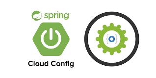

#  Avemex-config-repo

This repository contains all the configuration files (*.yml files) for all micro.services in the "Avemex BI" 
for two platforms:
* Local no docker: `localNoDocker` platform tu run the microservice inside the IDE. 
* Docker: `docker` on-premise (docker desktop).

## File structure

All config files follow the `Spring Config Server` where ii is as follows:

* <micro-service-name>.yml for `default` configuration different from application.yml, inside the proyect.
* <micro-service-name>-localNoDocker for configuration to run inside the IDE. All URLs are `localHost`.
* <micro-service-name>-docker for configurations inside the `Docker desktop`, i.e., the container name.

This repository is utilized by the `avemex-config-service` microservice and are just for `Docker desktop` platform.

All the files are read using `gitHub` repository.

### Contact AI Legorreta

Feel free to reach out to AI Legorreta on [web page](https://legosoft.com.mx).

Version: 1.0.0
©Avemex SA de CV, 2024
